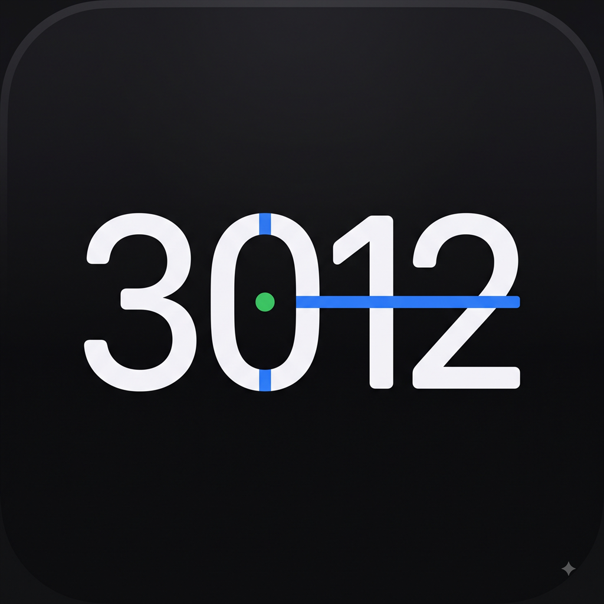

<p align="center">
  
</p>

# 3012

3012 là dự án iOS mã nguồn mở đang được viết lại theo hướng native, tối giản và dễ kiểm tra. Mục tiêu của dự án là cung cấp một giao diện quản lý catalog/package hiện đại, cho phép nội dung được cập nhật từ server mà không phải đóng gói lại IPA sau mỗi lần thay đổi catalog.

> **Trạng thái:** bản `0.1.0-dev` hiện mới là app shell và UI preview. Download manager, chữ ký catalog, package `.3012pkg`, apply và restore đang nằm trong roadmap; chưa được tuyên bố là đã hoạt động.

## Điểm chính

- SwiftUI thuần, hỗ trợ iPhone/iPad, Light/Dark Mode và Dynamic Type.
- Giao diện theo ngôn ngữ thiết kế hệ thống iOS, hạn chế hiệu ứng nặng.
- Tách theo feature/module để dễ review và kiểm thử.
- Hướng tới catalog online có chữ ký và package bất biến theo version.
- Hướng tới background download, pause/resume và streaming verification cho file lớn.
- Có GitHub Actions build IPA unsigned từ clean checkout.
- Baseline hiện tại không tích hợp quảng cáo, telemetry hoặc AI runtime.

## Nguồn gốc và ghi công

3012 được tạo và duy trì bởi **Le The Khoi ([@userlethekhoi](https://github.com/userlethekhoi))**.

Dự án là một bản remake độc lập được hình thành từ trải nghiệm sử dụng và nghiên cứu kiến trúc của **3105**, dự án do **YangJiii** phát triển. Xin chân thành cảm ơn YangJiii và những người đã đóng góp cho dự án gốc vì đã cho phép quá trình remake diễn ra.

3012 không nhận phần công sức của 3105 là của mình. Repository mới chủ động không mang theo patch payload, binary phát hành, package `.3105`, nhận diện sản phẩm hoặc dữ liệu người dùng của dự án cũ. Những thành phần nền tảng nào được bổ sung trong tương lai chỉ được đưa vào sau khi quyền sử dụng và yêu cầu ghi công đã được kiểm tra.

Thông tin chi tiết nằm trong [THIRD_PARTY_NOTICES.md](THIRD_PARTY_NOTICES.md).

## Cấu trúc repository

```text
3012/
├── App/                 # App entry và root navigation
├── DesignSystem/        # Theme và UI primitives
├── Features/            # Store, Installed, Downloads, Settings
├── Models/              # Domain models không phụ thuộc UI
└── Resources/           # Info.plist và asset catalog

3012.xcodeproj/          # Xcode project và shared scheme
.github/workflows/       # CI/build IPA unsigned
docs/                    # Kiến trúc, phát triển và hướng dẫn sử dụng
```

Xem [kiến trúc](docs/ARCHITECTURE.md) và [quy trình phát triển](docs/DEVELOPMENT.md) trước khi thay đổi module.

## Yêu cầu

- macOS có Xcode 16 hoặc mới hơn.
- iOS/iPadOS 16.0 trở lên.
- Không cần certificate để build kiểm tra unsigned trên CI.
- Cần Apple Development/Distribution identity và provisioning profile phù hợp để cài bản signed lên thiết bị.

## Build bằng Xcode

```bash
git clone https://github.com/userlethekhoi/3012.git
cd 3012
open 3012.xcodeproj
```

Trong Xcode:

1. Chọn scheme `3012`.
2. Chọn simulator để xem UI, hoặc cấu hình Signing & Capabilities cho thiết bị thật.
3. Chạy **Product → Build** hoặc **Product → Run**.

Build unsigned bằng command line:

```bash
xcodebuild \
  -project 3012.xcodeproj \
  -scheme 3012 \
  -configuration Release \
  -sdk iphoneos \
  -destination 'generic/platform=iOS' \
  CODE_SIGNING_ALLOWED=NO \
  CODE_SIGNING_REQUIRED=NO \
  clean build
```

## Build IPA bằng GitHub Actions

Workflow [`.github/workflows/build.yml`](.github/workflows/build.yml) chạy khi push vào `main`, mở pull request, push tag `v*` hoặc chạy thủ công.

1. Mở tab **Actions** trên GitHub.
2. Chọn **Build 3012**.
3. Chọn **Run workflow**.
4. Khi job hoàn thành, tải artifact có tên `3012-unsigned-<commit>`.

Mỗi build thành công trên `main` cũng cập nhật prerelease cố định `dev-latest` và thay thế file `3012-unsigned.ipa`. Tag dạng `v*` tạo một GitHub Release riêng; tag có dấu gạch nối như `v0.2.0-beta.1` được đánh dấu prerelease.

IPA trong artifact và Release đều là unsigned. Việc ký và phân phối phải tuân theo điều khoản Apple và chứng chỉ thuộc quyền sử dụng của người phát hành. Workflow dùng `GITHUB_TOKEN` tự cấp; không cần và không được commit Personal Access Token.

## Cách sử dụng bản hiện tại

1. Build và mở app.
2. Tab **Kho** hiển thị mock data chỉ để kiểm tra UI.
3. Tab **Đã cài** và **Tải xuống** đang là empty state.
4. Tab **Cài đặt** cho phép đổi Light/Dark/System và chọn channel minh họa.

Không sử dụng mock package như một package thật. Xem [hướng dẫn sử dụng](docs/USAGE.md) để theo dõi khả năng hiện có theo phiên bản.

## Nguyên tắc catalog/package tương lai

- Package dùng URL bất biến theo `id/version`.
- Catalog và package phải được xác minh bằng publisher key được pin trong app.
- SHA-256 trong catalog chỉ dùng kiểm tra toàn vẹn, không thay thế chữ ký.
- App không tải hoặc chạy script, dylib hay executable từ catalog.
- Patch bị thu hồi phải được đánh dấu `revoked`; không âm thầm xóa dữ liệu đang có trên thiết bị.
- Chỉ phát hành nội dung có quyền sử dụng và phân phối.

## Đóng góp

Đọc [CONTRIBUTING.md](CONTRIBUTING.md) trước khi mở pull request. Thay đổi nên nhỏ, có lý do rõ ràng, không kèm artifact build, secret hoặc package phát hành.

Lỗ hổng bảo mật phải được báo cáo theo [SECURITY.md](SECURITY.md), không đăng public kèm dữ liệu nhạy cảm.

## License

3012 được phát hành theo [GNU General Public License v3.0](LICENSE). Thành phần bên thứ ba, nếu có, tiếp tục tuân theo giấy phép và thông báo bản quyền riêng của thành phần đó.

---

### English summary

3012 is an independent SwiftUI rewrite inspired by the product experience and architecture of the original 3105 project. The current `0.1.0-dev` baseline contains a clean UI shell and unsigned IPA build workflow; remote catalogs, signed packages, downloads, apply, and restore remain work in progress. Created and maintained by [Le The Khoi](https://github.com/userlethekhoi).
